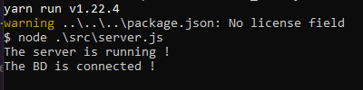
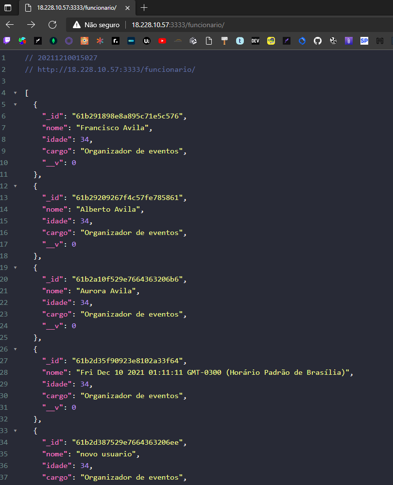
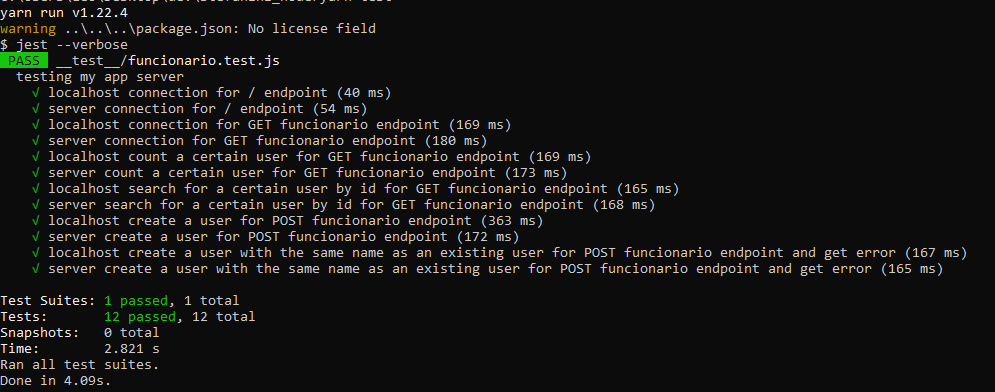

<h2 align="center">Esta é uma api simples de cadastro de usuário com integração AWS e testes automatizados !!</h2>

 

Nos trechos de código e explicação a seguir darei uma breve explicação 
do que o sistema faz e como ele está dividido e com algumas imagens ilustrativas dele funcionando. Para isso iremos devir em **3** tópicos
sendo eles: **Sobre este projeto**, **Tecnologias**, **organização das pastas** e **instalação**.
Vamos lá!!

 

## 📄 **Sobre este projeto**

Este projeto é uma REST FULL API para cadastro de funcionários, onde tem o propósito de utilizar serviços AWS EC2 e automação de testes, para poder ver a API funcionando acesse o link: http://18.228.10.57:3333/funcionario/

 

## 🚀 **Tecnologias**
- [Node.js](https://nodejs.org/en/)
- [cors](https://www.npmjs.com/package/cors)
- [express](https://expressjs.com/pt-br/)
- [mongoose](https://mongoosejs.com/)
- [axios](https://github.com/axios/axios)
- [jest](https://jestjs.io/pt-BR/)
- [AWS-EC2](https://aws.amazon.com/pt/ec2/?ec2-whats-new.sort-by=item.additionalFields.postDateTime&ec2-whats-new.sort-order=desc)

 

## 📂 **Organização de pastas**
**test/**: Aqui está centralizada toda a parte de testes da aplicação, nela você vai poder encontrar o arquivo *funcionario.test.js* que será responsável por executar todos os testes referentes a entidade funcionário.

 

**assets/**: Esta pagina em específico não tem muita importância, aqui só estão as imagens que fazem parte do README.md.

**src/entites/**: Nesta página está localizada todas as entidades do sistema, no caso o schema do funcionário com todos os seus atributos.

**src/routes/**: Aqui vai estar separada toda a parte de endpoints do projeto, no caso desta pasta em específica temos o arquivo *funcionario.js* que tem todas as suas rotas presentes.

**src/useCases/Funcionario/**: Nesta parte de useCases seria toda a logística e ações que as entidades podem realizar no sistema, sendo está pasta a do funcionário tendo os arquivos de: criar, pesquisar, indexar, atualizar e deletar funcionário.

**config.js**: Configuração de conecção com o mongoDB

**server.js**: O coração e servidor de toda a aplicação, aqui estão:
- conexão do banco de dados, no caso está sendo utilizado o mongoDB
- conexão das rotas
- cors
- listen do servidor

 

## 🔨 instalação

Para instalar as dependências utilize:
> npm install ou yarn

 

Para iniciar a aplicação com o node:
> yarn/npm start

ou

Para iniciar a aplicação com o nodemon:
> yarn/npm dev

 

e esta mensagem aparecerá no seu terminal:

    

Para poder acessar a API remotamente digite no seu browser, postman ou insomnia com a rota GET:
> http://localhost:3333/funcionario ou http://18.228.10.57:3333/funcionario/

 

e o resultado será algo como isso:

    

 

Para realizar os testes automatizados digite em seu terminal:
> yarn/npm test

 

e esta mensagem aparecerá no seu terminal:

    

Lembrando !! Os arquivos de testes fazem checagem tanto do servidor local quanto o do AWS, para ter 12/12 testes passados, se estiver tendo 6/12 provavelmente ou o servidor local não está funcionando ou o AWS.

---

Feito com 💜 por LEONARDO M. 👋 [veja meu linkedin](https://www.linkedin.com/in/leonardo-muniz-a39984144/)
 
